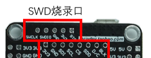
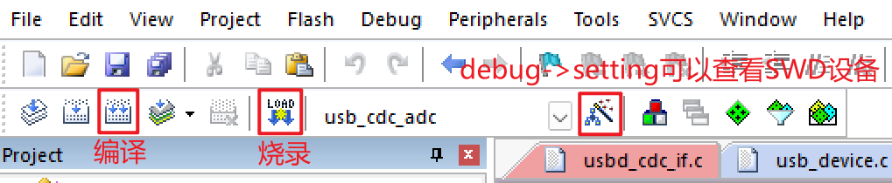

## Introduction

An open source repo of the article 《》

## Hardware
### Structure

### Components
|Name|Description|
| --- | --- |
|STM32H750VBT6|Text|
|BlueTooth|Text|
|Photosensitive Diode(PD)|Text|
|Laser|Text|

## Code Structure
- `Core`
  - Core code. Inc: Header files. Src: Source files for various functions and the main program `main.c`. The `*.s` file in Startup initializes the entire hardware system (those who understand assembly language can take a look, as it includes the initialization process for the entire MCU and the entry point for the main program).
- `MDK-ARM`
  - The `.uvprojx` file is a Keil project. When opened with Keil, it has already completed the settings for linking libraries and compilation, allowing direct compilation and flashing.
The linking directory includes the upper-level `USB_DEVICE`, `Drivers`, and `Middlewares`.
- Others
  - `Debug`: Various files and directories generated during the compilation and linking process.
  - `Drivers-CMSIS`: Cortex-M core-related files, providing interfaces for STM32 chip cores and peripheral access. It includes startup files (`startup_xxx.s`), which are responsible for hardware initialization, as well as optimized libraries.
  - `Middlewares`, `USB_DEVICE`: Library files, including STM32 USB drivers.

## How to compile

The encapsulation model we are using does not have a USB-to-serial module and can only be programmed using SWD, as shown in the figure below:

### Use ARM Keil 

Open the MDK-ARM/usb_cdc_adc.uvprojx project with Keil.

Connect the 3V3, GND, SWCLK, and SWDIO pins of the ST-Link to the corresponding pins on the board, and then connect it to the computer. You can then program the device using the Keil software.

If you purchase a board with a USB-to-serial module, you can directly use a USB cable for serial programming.

### Use STM32CubeIDE

